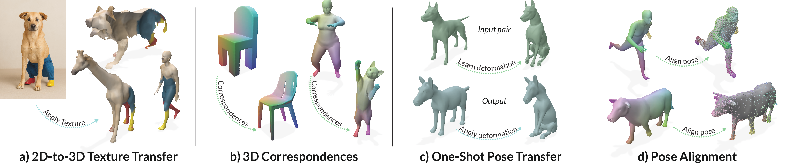

## Surface-Aware Distilled 3D Semantic Features




### SIGGRAPH Asia 2025

#### [🌐 Project Page](https://graphics.tudelft.nl/SurfaceAware3DFeatures) | [📝 Paper](https://arxiv.org/abs/2503.18254) 

**[Lukas Uzolas](https://lukas.uzolas.com/), 
[Elmar Eisemann](https://graphics.tudelft.nl/~eisemann/),
[Petr Kellnhofer](https://kellnhofer.xyz/)**
<br>
[Delft University of Technology](https://graphics.tudelft.nl/)
<br>

Many 3D tasks such as pose alignment, animation, motion transfer, and 3D reconstruction rely on establishing correspondences between 3D shapes. This challenge has recently been approached by matching of semantic features from pre-trained vision models. However, despite their power, these features struggle to differentiate instances of the same semantic class such as "left hand" versus "right hand" which leads to substantial mapping errors. To solve this, we learn a surface-aware embedding space that is robust to these ambiguities. Importantly, our approach is self-supervised and requires only a small number of unpaired training meshes to infer features for new 3D shapes at test time. We achieve this by introducing a contrastive loss that preserves the semantic content of the features distilled from foundational models while disambiguating features located far apart on the shape's surface. We observe superior performance in correspondence matching benchmarks and enable downstream applications including in-part segmentation, pose alignment, and motion transfer.


### Set Up
Set Up Environment:

```bash
conda env create -f environment.yaml && conda activate sa3df && pip install "git+https://github.com/facebookresearch/pytorch3d.git@stable"
```
For more information consult [Pytorch3D](https://github.com/facebookresearch/pytorch3d/blob/main/INSTALL.md) (Needed for Diff3F). SMALify requires Python 3.10 to run. Note that [torch-scatter](https://pypi.org/project/torch-scatter/) and torch-sparse can be finicky, you might have to check the their pip page if you encounter any issues.


If you run into problems with the PositionNet import in `Diff3D/unet_2d_condition.py`, you will have to change the import as follows:

```python
import diffusers
if diffusers.__version__ >'0.25':
    from diffusers.models.embeddings import GLIGENTextBoundingboxProjection as PositionNet
else:
    from diffusers.models.embeddings import PositionNet
```

### Data

The `scripts` folder contains all data generation scripts. To replicate the training, you will need to download the Surreal and SMAL data set, adapt the paths in `scripts/paths` and then run `generate_surreal5k_dataset.py` and `generate_smal_dataset.py`. Similarly, you will need to obtain the data for SHREC'19, SHREC'20, TOSCA, ShapeNet datasets for evaluation. To obtain the data, check the paper references. You will also need to obtain the SMPLH model for some of the applications.

#### Dummy Data
If you are only interested in quickly checking out the applications, you can just generate some dummy data the following way:
```bash
python ./scripts/generate_smal_ours_shape_dataset.py && python ./scripts/generate_polyhaven_dataset.py && --animals python ./scripts/generate_polyhaven_dataset.py
```
This will preprocess few SMAL meshes and meshes from Polyhaven which can be used for the applications notebook. Note that the Polyhaven shapes were not used in the paper, so results might differ.

#### Custom Data
You can adapt the python `./scripts/generate_polyhaven_dataset.py` for your purposes. It basically processes a folder of meshes (see `./data/raw_polyhaven_chairs`) by closing & remeshing it and extracting the Diff3F features.


### Training
To retrain the network trained on humans and animals run the following:
```bash
python train_feature_network.py --exp_name humans_and_animals --exp_path ./experiments --train_data surreal smal --val_pairs 0 48 48 0 49 97 97 49 --FN_render_iter 500
```

A note on the validation pairs (`--val_pairs`), in the example above, during training correspondences of samples 0 -> 48, 48 -> 0, 49 -> 97, and 97 -> 49 for the surface-aware and base features will be visualised. Validation losses will be calculated on 0, 48, 49, and 97. The training data is a concatenation of the Surreal and SMAL dataset, where the first two indices correspond to samples from Surreal and the latter to samples from SMAL. To train the ShapeNet chair network, replace `--train_data surreal smal`with `--train_data shapenet_chair`. Adjust the validation pairs accordingly.

Another use-case would be to inlcude the validation samples during training, as the method is self-supervised after all. This can be achieved by adding the `--train_on_validation` flag. For example:
```bash
python train_feature_network.py --exp_name polyhaven_chairs --exp_path experiments --train_data  polyhaven_chair --val_pairs 2 3 3 2 --FN_iters 5000 --FN_render_iter 500 --train_on_validation
```

### Applications
To run the applications (`applications.ipynb`), you will need to set up the dummy data (See section 'Dummy Data' above), and either retrain the networks or download the weights from the pre-trained models.

### Weights
_Soon_

### License

This project is licensed under the GNU General Public License v3.0 (see [LICENSE.txt](./LICENSE.txt)). With the exception of `config.py` which is licensed under the MIT License  — [Link to license](https://opensource.org/licenses/MIT). Please refer to file’s header for specific licensing and copyright details.

The provided meshes in the data folder originate from [polyhaven.com](https://polyhaven.com) under the CC0 license.


### Citation

```
@misc{uzolas2025surfaceawaredistilled3dsemantic,
      title={Surface-Aware Distilled 3D Semantic Features}, 
      author={Lukas Uzolas and Elmar Eisemann and Petr Kellnhofer},
      year={2025},
      eprint={2503.18254},
      archivePrefix={arXiv},
      primaryClass={cs.CV},
      url={https://arxiv.org/abs/2503.18254}, 
}
```