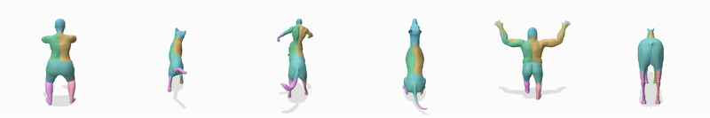

## Surface-Aware Distilled 3D Semantic Features

### SIGGRAPH Asia 2025

#### [🌐 Project Page](https://lukas.uzolas.com/SurfaceAware3DFeatures/) | [📝 Preprint](https://arxiv.org/abs/2503.18254) 




**[Lukas Uzolas](https://lukas.uzolas.com/), 
[Elmar Eisemann](https://graphics.tudelft.nl/~eisemann/),
[Petr Kellnhofer](https://kellnhofer.xyz/)**
<br>
[Delft University of Technology](https://graphics.tudelft.nl/)
<br>

Many 3D tasks such as pose alignment, animation, motion transfer, and 3D reconstruction rely on establishing correspondences between 3D shapes. This challenge has recently been approached by matching of semantic features from pre-trained vision models. However, despite their power, these features struggle to differentiate instances of the same semantic class such as "left hand" versus "right hand" which leads to substantial mapping errors. To solve this, we learn a surface-aware embedding space that is robust to these ambiguities. Importantly, our approach is self-supervised and requires only a small number of unpaired training meshes to infer features for new 3D shapes at test time. We achieve this by introducing a contrastive loss that preserves the semantic content of the features distilled from foundational models while disambiguating features located far apart on the shape's surface. We observe superior performance in correspondence matching benchmarks and enable downstream applications including in-part segmentation, pose alignment, and motion transfer.


**Code will be released by 01.12.25**

### Citation

```
@misc{uzolas2025surfaceawaredistilled3dsemantic,
      title={Surface-Aware Distilled 3D Semantic Features}, 
      author={Lukas Uzolas and Elmar Eisemann and Petr Kellnhofer},
      year={2025},
      eprint={2503.18254},
      archivePrefix={arXiv},
      primaryClass={cs.CV},
      url={https://arxiv.org/abs/2503.18254}, 
}
```
